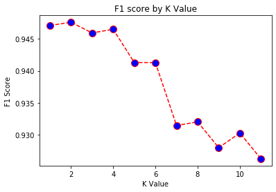
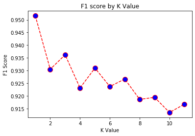

# Fly High 
Emilia Orellana

Downloaded specific traits in [Bureau of Transportation](https://www.transtats.bts.gov/DL_SelectFields.asp?Table_ID=237)

## Introduction:
For this project I created a multi classification project. Using the data downloaded from the Bureau of Transportation I have specified three states New York, New Jersey, and California. The most popular flights in the United States are between JFK, New York and LAX, California. I included EWR, New Jersey because EWR is an airport commonly used as an option for New Yorkers who live in Manhattan or the Bronx. The data includes all the flights between the 3 airports EWR, JFK, LAX in 2019. 

I classify a flight as on time, delay or cancelled. 

    The libraries used in this project includes:
        - Pandas
        - NumPy
        - Matplotlib
        - Statsmodels
        - Sklearn
    
In this repo I have included a functions.py notebook in which contains all the functions used in this project. 

## Data Preproccessing:
After importing the data I concated all 3 airports to be in one dataframe. I created a function in which classifies flights to be delayed if their departure time is greater than 0 minutes and return boolean columns to return true and false. This will be useful when I classify into classes. Anything else is ontime, and cancelled flights are specified prior. Then I gave the three classes a numerical value, 1= cancelled, 2= delayed, 3= ontime. This is essential when contructing EDAs and for modelling. In addition for the cancelled flights I filled in the null values for Departure Time, Departure Delay, Arrival Time, Arrival Delay, and Airtime. 
 
    The starter notebook is : 
     'DataProcessing&Cleaning.ipynb'
     
The travel time for all three airports are:
    LAX -> JFK/EWR - 4 hours 44 minutes
    JFK -> LAX - 5 hours 30 minutes
    EWR -> LAX - 5 hours 20 minutes

# Airports
An analysis of each airport is found in the [AirportNotebooks](https://github.com/emilia329/Mod5/tree/master/AirportNotebooks) Inside the folder is a notebook for each airport with an analysis of each airline that flies out that airport. In addition I also looked in Holiday dates and how they impact delays. 

## JFK 

In the airport JFK, New York there are only four airlines in which travel directly to LAX,California. The airlines are American Airlines, JetBlue, Delta, and Alaska Airlines. 
JFK percentage of on time flights is 72.2%

Now Delta Airlines is interesting as it is the only airline in JFK that does not have a cancelled flight. In addition we can see the month of August has more delayed flights than on time flights. 

## EWR

Newark airport is interesting because there are only two airlines in which fly to LAX. I decided to look into Neward as well mainly because for some New Yorkers who live in Manhattan and the Bronx, Newark is more convinent. But only United Airlines and Alaska Airlines fly to LAX, Los Angeles. 
The percentage of on time flights is 57.9%

Interesting enough the airline United Airlines had more delayed flights than on time flights in the months June through August. Now these months are vacation months which can be a reason for its delays. 

## LAX 

There are siz airlines in which fly form LAX to the East coast. United Airlines is the only airline which travels to Newark, in additio to Alaska Airlines. The remaining four ailines travel to JFK.
The percentage of on time flights in LAX is 63%.

Delta Airline seems to have moe delayed than on time flights for May through August. These flights are going only to JFK as EWR only has two airline that fly through. 

# Models 
Each airport has its own notebook for every model that was applied. It can be found in  [Final Models](https://github.com/emilia329/Mod5/tree/master/Final%20Models)

I ran four different models along with grid search in order to hypertune each model. The models I ran were Logistic Regression, Random Forest, KNN, and XGBoost. Before running the models I had to SMOTE my values since I had class imbalance. In addition, I had to identify the variable that high a high influence which was Departure Delay time (makes sense).

The evaluation metrics we are looking at is F1 score. We want a balance between precison and recall. Since recall calculates true positives and precison takes into account how many are actually positive. It takes into account false positives and false negatives.

The models perform pretty well all around when compared to the baseline model F1 score of 0.0334. Not all airports performed the best with the same model. KNN gave the best results for EWR, and JFK at a kvalue= 1. Their F1 scores were 

EWR: 

    F1 Score
Micro -  0.9448     
Macro - 0.945449
Weighted - 0.944799

JFK: 

    F1 Score
Micro -  0.953136   
Macro - 0.953192
Weighted - 0.953044

LAX actually performed best with a hypertune Random Forest model. 
    
    F1 Score
Micro -  0.940596
Macro - 0.940893
Weighted - 0.940579

# Weather Data 
I decided to look into the weather of each location to idenfity flight delays based on weather. I gathered the data through DarkSky API. 

The step by step code for how I did the API calling for each airport can be found in [APICalling](https://github.com/emilia329/Mod5/tree/master/API%20Calling)

After I gathered by data I began analyzing it in seperate notebooks for organization purposes. Each location was analysis in a seprate notebook as I also completed an ANOVA model. 

The analysis of each location can be found in 
[Weather Analysis](https://github.com/emilia329/Mod5/tree/master/Weather%20Analysis)

## Analysis 
Although JFK and EWR are close in distance the delay dates based on weather did not match. Interesting enough LAX had very few flight delays due to weather. The maximum flights is 2 delayed due to weather. From LAX top 3 flights only one flight delayed because of weather at origin. The other two were weather issues in the destination. As predicted JFK had the most flights delayed due to weather conditions. A majority were in the winter season. There are  a few days in which weather was not an issue in the origin or destination, therefore I chose to believe there were bad weather conditions in Midwest.

# Conclusion and Future Steps

JFK has the highest percentage of on time flights in comparison to the other airports. This project determined Delta Airline has the most delayed flights but least cancelled flights. With this information a person can make the decision on which airline to travel with. Delta will not cancel a flight, they prefer to wait out the delay and then fly when it is possible. This can be useful when a person need to be at a location for an important reason. In LAX, it is very unlikely for a flight to be canclled due to weather conditions.

To futher this project, I hope to completed a Neural Network multi-classification model. In addition it would be interesting to see NAS data and how flights are delayed by air traffic. 

