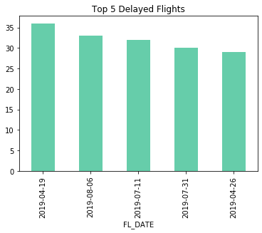

# Fly High 
Emilia Orellana

Downloaded specific traits in 
data: https://www.transtats.bts.gov/DL_SelectFields.asp?Table_ID=237

## Introduction:
In this project I created a multi classification project. Using the data downloaded from the Bureau of Transportation I have specified three states New York, New Jersey, and California. The most popular flights in the United States are between JFK, New York and LAX, California. I included EWR, New Jersey as EWR is an airport commonly used as an option for New Yorkers. 
The data includes all the flights between the 3 airports EWR, JFK, LAX in 2019. 

I classify a flight as on time, delay or cancelled. In the end I will be able to inform you which airline is best to travel with and which airline handles delays the best. 

The libraries used in this project includes:
    - Pandas
    - NumPy
    - Matplotlib
    - Statsmodels
    - Sklearn
    
In this repo I have included a functions.py notebook in which contains all the functions used in this project. 

## Data Preproccessing:
After importing the data I concated for all 3 airports to be in one dataframe. I created boolean columns to return true and false, this will be useful when I classify into classes.Afterwards, I created a function in which classifies flights to be delayed if their departure time is greater than 0 minutes. Anything else is ontime, and cancelled flights are specified prior. Then I gave the three classes a numerical value, 1= cancelled, 2= delayed, 3= ontime. This is essential when contructing EDAs and for modelling. 
 
    The starter notebook is : 
     'usethisone.ipynb'

## JFK 

From the visual we can identify the four airlines which travel to LAX. The airlines are AmericanAirlines, Jetblue, Delta, and Alaska Airline. 

I have also looked into the flight dates in which had the most delayed flights. This will be analyzed more in depth later on with the weather of the location. 

Now Delta Airlines is interesting as it is the only airline in JFK that does not have a cancelled flight. In addition we can see the month of August has more delayed flights than on time flights. 

## EWR

Newark airport is interesting because there are only two airlines in which fly to LAX. I decided to look into Neward as well mainly because for some New Yorkers who live in Manhattan and the Bronx, Newark is more convinent. But only United Airlines and Alaska Airlines fly to LAX, Los Angeles. 

These top 5 fligth dates with the most delays will also be looked into with weather data gathered to identify if these specific dates had weather issues based on its delays.

Interesting enough the airline United Airlines had more delayed flights than on time flights in the months June through August. Now these months are vacation months which can be a reason for its delays. 

## LAX 

These are the airline in which fly form LAX to the East coast. United Airlines is the only airline which travels to Neward, the rest are combination of EWR and JFK. 

Interesting enough the top delayed flight dates are in the spring season. The results of analyzing these dates with the weather data may show rain being a big factor of the delay. 

Delta Airline seems to have moe delayed than on time flights for May through August. These flights are going only to JFK as EWR only has two airline that fly through. 

# Models
    In the :
        'EWRModel.ipynb'
        'JFKModel.ipynb'
        'LAXModel.ipynb'

I have completed two different models for each airport. I picked to run a Logistic Regression Model and Random Forest. Before running the models I had to SMOTE my values since I had class imbalance. In addition, I had to identify the variable that high a high influence which was Departure Delay time (makes sense).

The evaluation metrics we are looking at is F1 score. We want a balance between precison and recall. Since recall calculates true positives and precison takes into account how many are actually positive. I was to assure the flight is being classified correctly as ontime, delayed or if it get cancelled.

The models perform pretty well all around. For all three airports Random Forest performed the best after doing gridsearch. 

JFK: .94
EWR: .93
LAX: .94

# Conclusion and Future Steps

This project determined Delta Airline has the most delayed flights but least cancelled flights. With this information a person can make the decision on which airline to travel with. Delta will not cancel a flight, they prefer to wait out the delay and then fly when it is possible. This can be useful when a person need to be at a location for an important reason. 

To futher this project, I plan to use weather data gathered from all three location of each airport and figure out the impact of weather delay. The data I have also has cloud cover value which would be interesting to discover how long would a flight be delayed based on cloud cover and precipitaion. 

